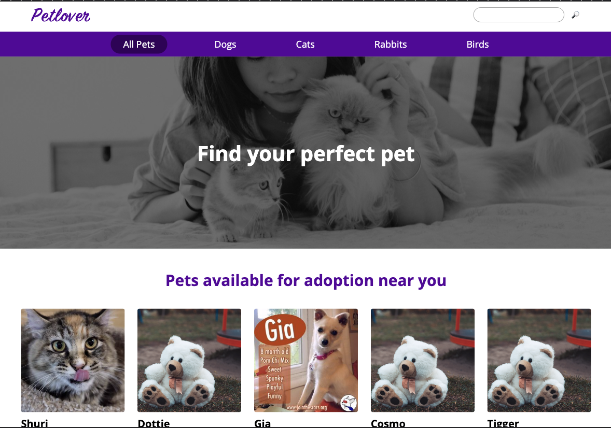

# React Router Adopt a Pet

View this project here: [https://main--charming-puffpuff-d8ff22.netlify.app/](https://main--charming-puffpuff-d8ff22.netlify.app/)

## Description

Student project for Codecademy Full-Stack Path.

**_Learning objective_**: To add client-side routing using React Router to an existing pet adoption website and thereby fix the broken features.

According to the assignment, I was to "add client-side routing to the application using React Router so that:

- The HomePage component responds to the browser's current URL by displaying only pets of the species the user wishes to view.
- The PetDetailsPage page displays when the browser's current URL includes a specific pet's id.
- The PetDetailsPage displays data for the correct pet based on the id in the URL parameters' values.
- When the user searches for a pet in the search bar, they are redirected to the SearchPage, which uses the query parameter called 'name' to filter pets by name.
- When a user clicks a pet whose details are not available, they are redirected to a PetNotFoundPage.
- From the PetNotFoundPage, users can click the 'Go Home' button that will take them to the root path page."

## Technical Features

- React Router hooks, utility functions, and components: createBrowserRouter, createRoutesFromElements, Route, RouterProvider, useParams, useSearchParams, createSearchParams, useNavigate, Navigate, NavLink, Link, Outlet (and the "to" prop)
- Static and dynamic routing, using JSX and URL Parameters
- Anchor links, which cause the page to refresh, replaced by NavLink and Link components, which do not cause the page to refresh, leading to better performance and improved UX
- Active CSS styling added to Links
- Implementation of a search feature using Reach Router so that when a user searches for a particular pet, the app redirects them to a page showing all pets whose names match the search query
- Implementation of a feature that redirects the user to a "Pet Details Not Found" page when the user clicks on a pet whose details are not available. To complete this feature, a "Go Home" button re-routes the user to the root, or home, page for a more seamless UX than was the case before. (Previously, the user was directed to a page displaying a 404 Not Found error.)

## Preview

